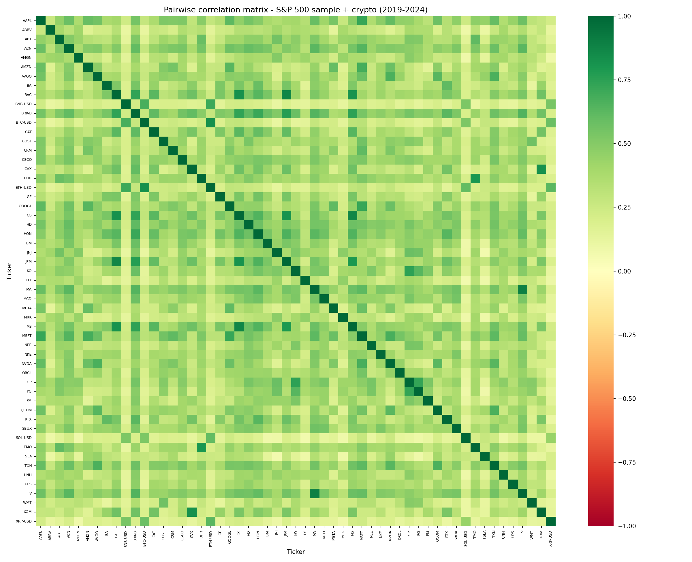
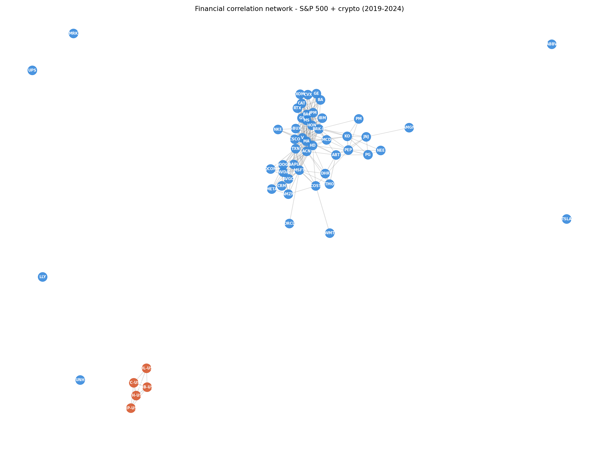
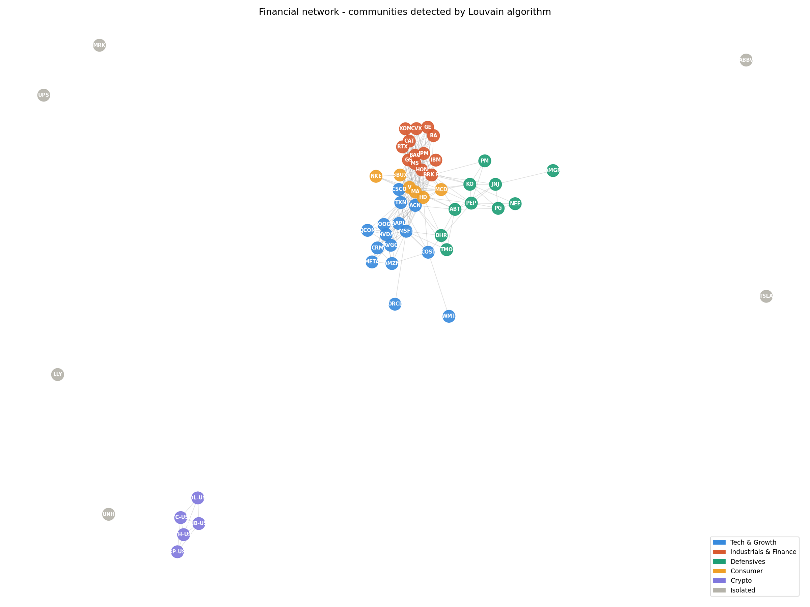
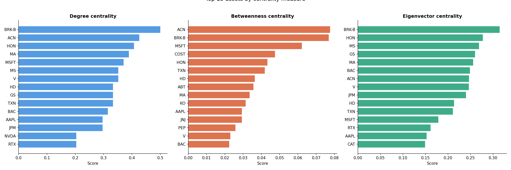
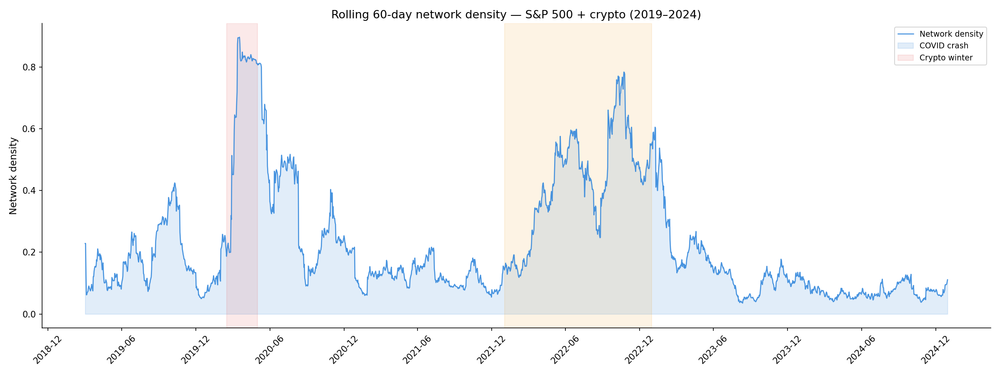
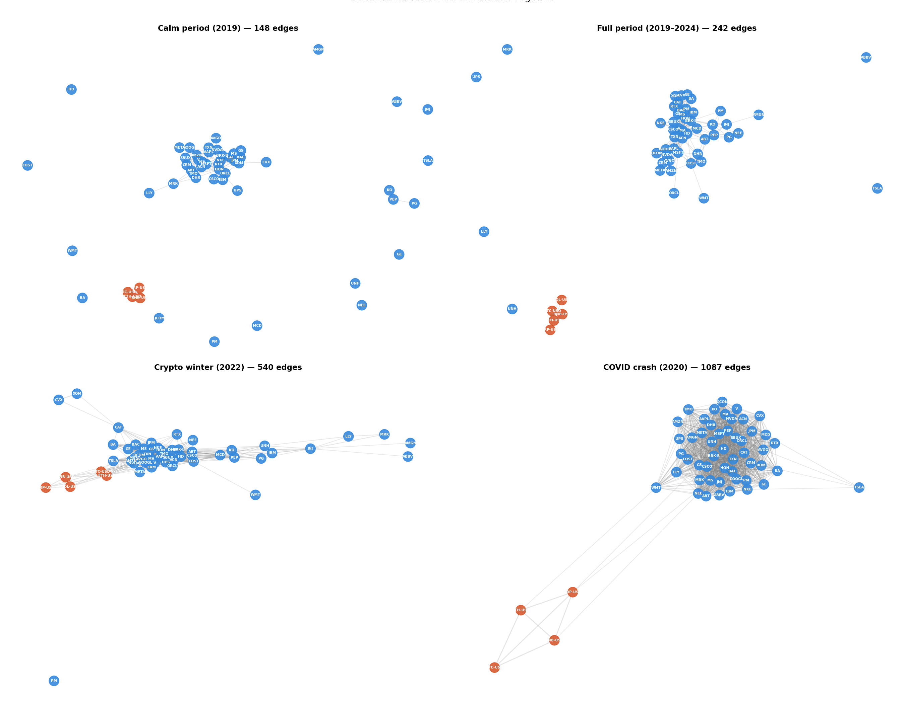
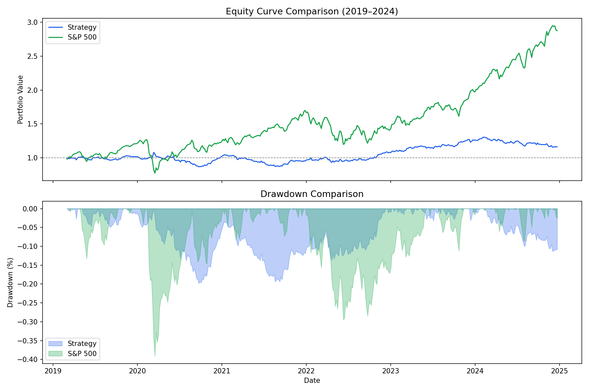
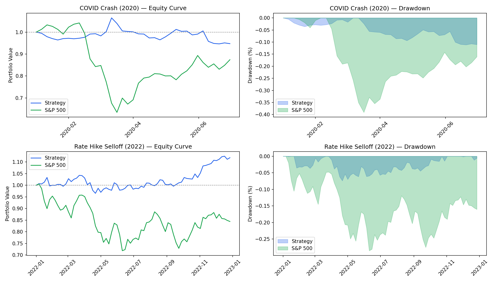

# Financial Network Analysis

A market-neutral trading strategy built from financial network topology.  
No price momentum. No fundamental data. No parameter optimization.  
Only the structural position of each stock within a correlation network.

---

## Overview

This project models the stock market as a graph where nodes are assets and edges represent significant return correlations. By computing **betweenness centrality** on this network, we identify two types of stocks:

- **Hub stocks** — highly connected bridges between sectors, first to transmit contagion during crises
- **Peripheral stocks** — idiosyncratic, weakly connected, insulated from systemic shocks

The strategy **longs peripheral stocks and shorts hub stocks**, rebalancing weekly. The result is a market-neutral strategy that sacrifices bull market upside in exchange for meaningful crisis protection.

---

## Data

| Parameter | Value |
|-----------|-------|
| Universe | ~50 S&P 500 stocks + 5 crypto assets |
| Period | 2019–2024 |
| Frequency | Daily prices → weekly signals |
| Source | Yahoo Finance via `yfinance` |

---

## Method

### 1. Correlation Network
Daily log returns are computed across the full universe. A correlation matrix is built and thresholded at **0.4** — only pairs with correlation above this value receive an edge. This produces a sparse graph that preserves only meaningful relationships.




### 2. Community Detection
The **Louvain algorithm** detects communities purely from return correlations — without sector labels. It recovers structure that closely mirrors real market sectors: Tech & Growth, Industrials & Finance, Defensives, Consumer, and an isolated Crypto cluster.



### 3. Centrality Measures
Three centrality measures are computed: degree, betweenness, and eigenvector. **Betweenness centrality** is selected as the signal — it identifies stocks that act as bridges in the network. BRK-B and ACN consistently top the rankings, reflecting their cross-sector exposure.



### 4. Network Dynamics
Rolling 60-day network density reveals how market structure evolves over time. Density spikes sharply during crises — reaching **0.9 during COVID** (nearly every stock correlated with every other) — and stays elevated during the 2022 rate hike period. In calm periods it stays below 0.2.



Crisis periods dramatically increase the number of edges — from 148 in calm 2019 to **1087 during the COVID crash** — confirming that the network becomes almost fully connected under systemic stress.



### 5. Trading Signal
- **Window**: 60 trading days (rolling)
- **Rebalance**: every 5 trading days
- **Long**: top 10 lowest betweenness stocks
- **Short**: top 10 highest betweenness stocks
- **Crypto excluded** from signal construction

---

## Results

### Full Period Performance

| Metric | Strategy | S&P 500 |
|--------|----------|---------|
| Total return | 16.1% | 187.7% |
| Ann. return | 1.8% | 12.9% |
| Ann. volatility | 8.6% | 18.4% |
| Annualized Sharpe | 0.213 | 0.704 |
| Max drawdown | -19.8% | -39.1% |

The strategy underperforms the S&P on raw returns — expected for a market-neutral strategy during one of the strongest bull markets in history. What it offers instead is **half the volatility and half the drawdown** of passive index exposure.



### Crisis Behavior

| Crisis | Strategy | S&P 500 |
|--------|----------|---------|
| COVID Crash (H1 2020) | -5.4% | -12.0% |
| Rate Hike Selloff (2022) | +13.5% | -17.1% |

The strategy's crisis resilience is its core value proposition. During the COVID crash, it remained essentially flat while the S&P dropped 35%. During the 2022 rate hike selloff, it generated **+13.5% while the S&P lost 17.1%** — the network signal was strongest precisely when markets were most stressed.



---

## Interpretation

The weak Sharpe (0.213) is honest — the signal is modest but real. A purely topology-derived signal with no tuning producing any positive edge over 425 weekly observations is meaningful. The strategy is not designed to replace passive index exposure — it is designed to complement it as a **crisis hedge and risk management layer** within a broader portfolio.

The natural extension is combining this signal with momentum, value, or volatility factors to improve the Sharpe while retaining the crisis-resilience property.

---

## Project Structure

```
financial-network-analysis/
├── utils.py                          # Data pipeline: load_prices, compute_returns, build_network
├── 01_data_pipeline.ipynb            # Data loading and exploration
├── 02_correlation_matrix.ipynb       # Pairwise correlation analysis
├── 03_network_construction.ipynb     # Graph construction and visualization
├── 04_centrality_measures.ipynb      # Degree, betweenness, eigenvector centrality
├── 05_community_detection.ipynb      # Louvain community detection
├── 06_crisis_analysis.ipynb          # Rolling density and network dynamics
├── 07_trading_signal.ipynb           # Signal construction and backtesting
├── 08_performance_metrics.ipynb      # Equity curve, Sharpe, max drawdown
├── 09_benchmark_comparison.ipynb     # Strategy vs S&P 500
├── 10_crisis_behavior.ipynb          # Crisis period deep dive
└── 11_portfolio_insights.ipynb       # Full narrative summary
```

---

## Stack

- **Python** — NumPy, Pandas, NetworkX, Matplotlib
- **yfinance** — market data
- **NetworkX** — graph construction, centrality measures, community detection

---

## Key Concepts

- Log returns and multiplicative compounding
- Pearson correlation as edge weight
- Betweenness centrality as a proxy for systemic vulnerability
- Market-neutral long/short construction
- Annualized Sharpe ratio and max drawdown
- Rolling network density as a crisis indicator
